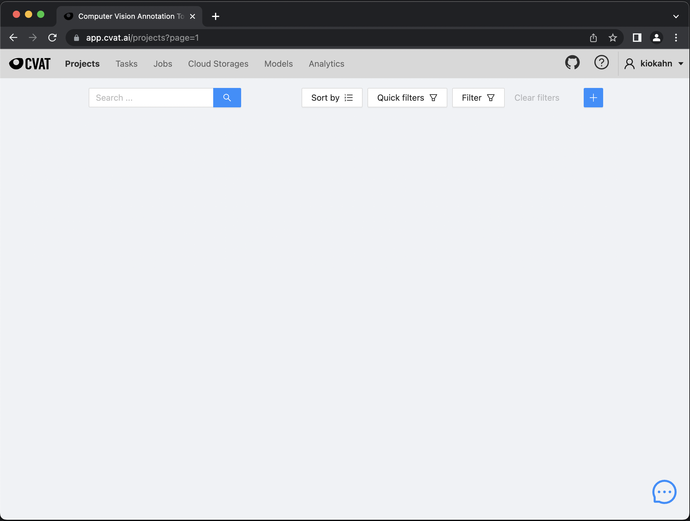
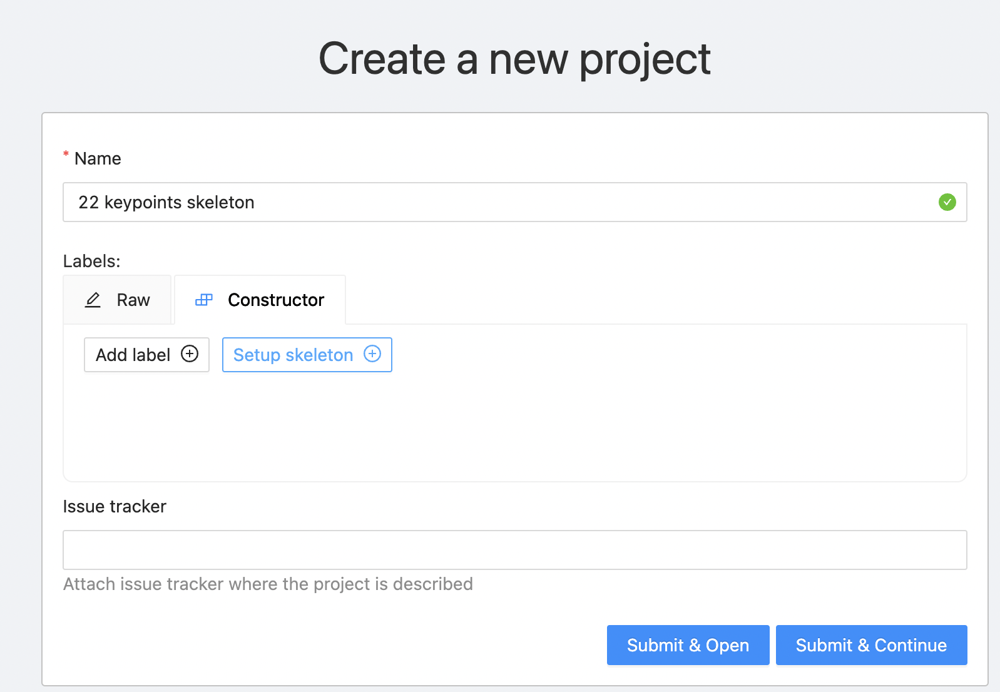
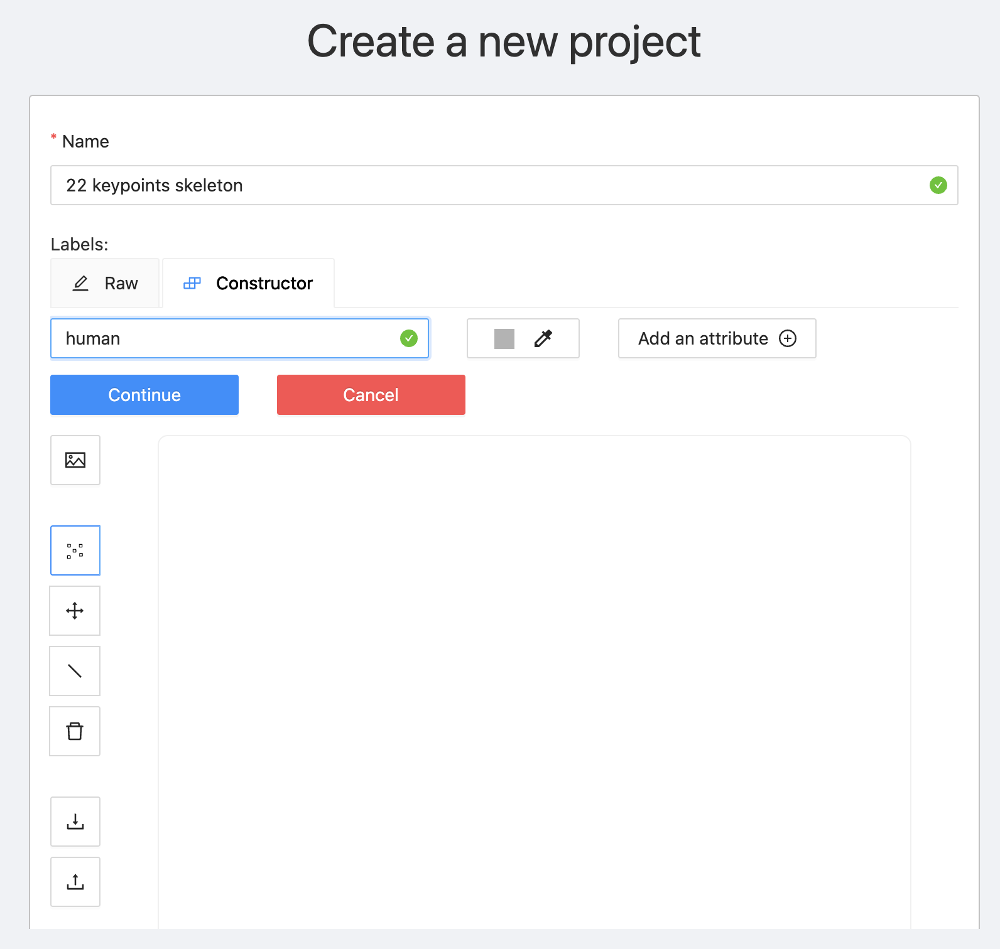
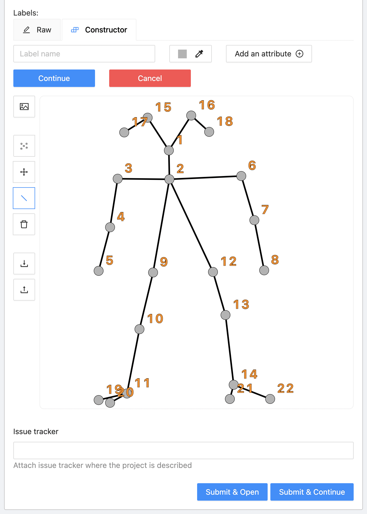
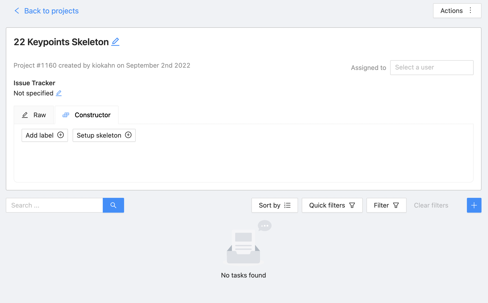
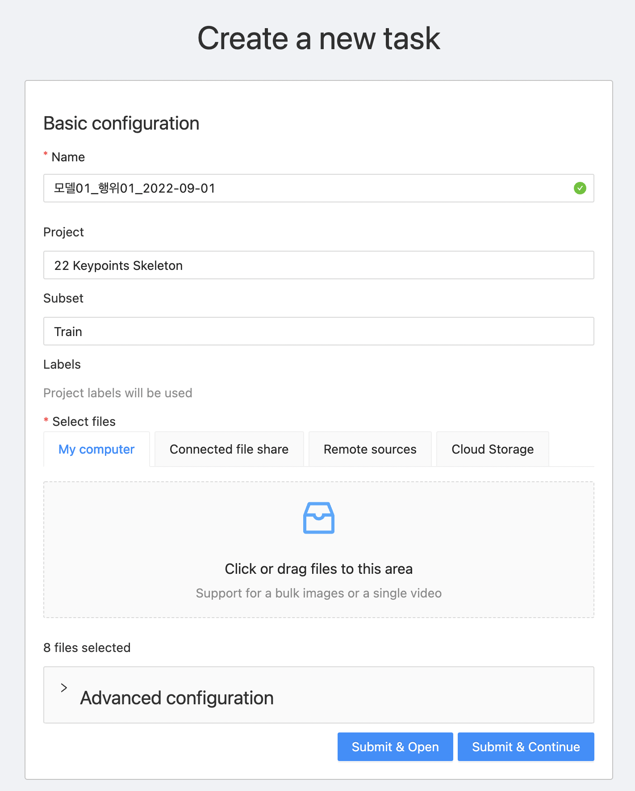
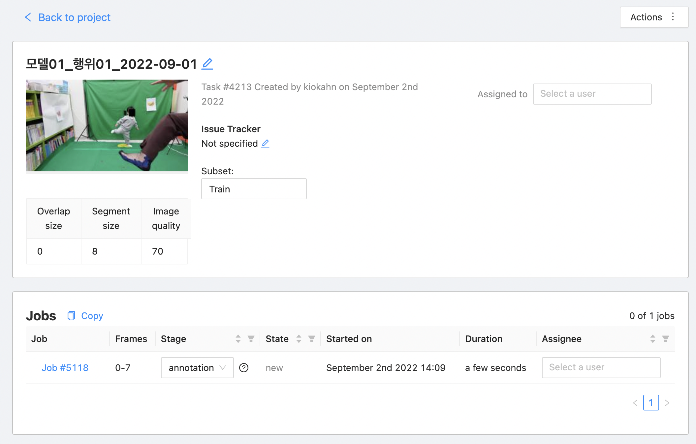

# Pose Estimation 
Keypoints Labeling By CVAT     


1. https://app.cvat.ai/


    

2. Projects
   - Create a new project         
        
   - 압력 : Edit Box "Name"       
       
   - 버튼 클릭 : "Setup Skeleton"     
       
   - Skeleton 구성    
       
```
[
  {
    "name": "Human",
    "id": 14316,
    "color": "#fa3253",
    "type": "skeleton",
    "sublabels": [
      {
        "name": "22",
        "attributes": [],
        "type": "points",
        "color": "#76bb18",
        "id": 14338
      },
      {
        "name": "21",
        "attributes": [],
        "type": "points",
        "color": "#c0762a",
        "id": 14337
      },
      {
        "name": "20",
        "attributes": [],
        "type": "points",
        "color": "#c8023c",
        "id": 14336
      },
      {
        "name": "19",
        "attributes": [],
        "type": "points",
        "color": "#9b8d37",
        "id": 14335
      },
      {
        "name": "18",
        "attributes": [],
        "type": "points",
        "color": "#bfa552",
        "id": 14334
      },
      {
        "name": "17",
        "attributes": [],
        "type": "points",
        "color": "#aaa246",
        "id": 14333
      },
      {
        "name": "16",
        "attributes": [],
        "type": "points",
        "color": "#74db1b",
        "id": 14332
      },
      {
        "name": "15",
        "attributes": [],
        "type": "points",
        "color": "#a7a570",
        "id": 14331
      },
      {
        "name": "14",
        "attributes": [],
        "type": "points",
        "color": "#de22a0",
        "id": 14330
      },
      {
        "name": "13",
        "attributes": [],
        "type": "points",
        "color": "#2ac791",
        "id": 14329
      },
      {
        "name": "12",
        "attributes": [],
        "type": "points",
        "color": "#daddec",
        "id": 14328
      },
      {
        "name": "11",
        "attributes": [],
        "type": "points",
        "color": "#22b16f",
        "id": 14327
      },
      {
        "name": "10",
        "attributes": [],
        "type": "points",
        "color": "#63bbfa",
        "id": 14326
      },
      {
        "name": "9",
        "attributes": [],
        "type": "points",
        "color": "#f067db",
        "id": 14325
      },
      {
        "name": "8",
        "attributes": [],
        "type": "points",
        "color": "#e2bc6e",
        "id": 14324
      },
      {
        "name": "7",
        "attributes": [],
        "type": "points",
        "color": "#1cdda5",
        "id": 14323
      },
      {
        "name": "6",
        "attributes": [],
        "type": "points",
        "color": "#57236b",
        "id": 14322
      },
      {
        "name": "5",
        "attributes": [],
        "type": "points",
        "color": "#478144",
        "id": 14321
      },
      {
        "name": "4",
        "attributes": [],
        "type": "points",
        "color": "#4a649f",
        "id": 14320
      },
      {
        "name": "3",
        "attributes": [],
        "type": "points",
        "color": "#479ffe",
        "id": 14319
      },
      {
        "name": "2",
        "attributes": [],
        "type": "points",
        "color": "#350dea",
        "id": 14318
      },
      {
        "name": "1",
        "attributes": [],
        "type": "points",
        "color": "#d12345",
        "id": 14317
      }
    ],
    "svg": "<line x1=&quot;52.50836181640625&quot; y1=&quot;6.354515075683594&quot; x2=&quot;60.033443450927734&quot; y2=&quot;9.53177261352539&quot; stroke=&quot;black&quot; data-type=&quot;edge&quot; data-node-from=&quot;16&quot; stroke-width=&quot;0.5&quot; data-node-to=&quot;18&quot;></line><line x1=&quot;47.65886306762695&quot; y1=&quot;17.39130401611328&quot; x2=&quot;52.50836181640625&quot; y2=&quot;6.354515075683594&quot; stroke=&quot;black&quot; data-type=&quot;edge&quot; data-node-from=&quot;1&quot; stroke-width=&quot;0.5&quot; data-node-to=&quot;16&quot;></line><line x1=&quot;41.30434799194336&quot; y1=&quot;6.688963413238525&quot; x2=&quot;35.45150375366211&quot; y2=&quot;11.371237754821777&quot; stroke=&quot;black&quot; data-type=&quot;edge&quot; data-node-from=&quot;15&quot; stroke-width=&quot;0.5&quot; data-node-to=&quot;17&quot;></line><line x1=&quot;47.65886306762695&quot; y1=&quot;17.39130401611328&quot; x2=&quot;41.30434799194336&quot; y2=&quot;6.688963413238525&quot; stroke=&quot;black&quot; data-type=&quot;edge&quot; data-node-from=&quot;1&quot; stroke-width=&quot;0.5&quot; data-node-to=&quot;15&quot;></line><line x1=&quot;71.07023620605469&quot; y1=&quot;81.77257537841797&quot; x2=&quot;75.91973114013672&quot; y2=&quot;92.14046478271484&quot; stroke=&quot;black&quot; data-type=&quot;edge&quot; data-node-from=&quot;14&quot; stroke-width=&quot;0.5&quot; data-node-to=&quot;22&quot;></line><line x1=&quot;71.07023620605469&quot; y1=&quot;81.77257537841797&quot; x2=&quot;79.09699249267578&quot; y2=&quot;90.13378143310547&quot; stroke=&quot;black&quot; data-type=&quot;edge&quot; data-node-from=&quot;14&quot; stroke-width=&quot;0.5&quot; data-node-to=&quot;21&quot;></line><line x1=&quot;66.72240447998047&quot; y1=&quot;63.54515075683594&quot; x2=&quot;71.07023620605469&quot; y2=&quot;81.77257537841797&quot; stroke=&quot;black&quot; data-type=&quot;edge&quot; data-node-from=&quot;13&quot; stroke-width=&quot;0.5&quot; data-node-to=&quot;14&quot;></line><line x1=&quot;62.87625503540039&quot; y1=&quot;51.337791442871094&quot; x2=&quot;66.72240447998047&quot; y2=&quot;63.54515075683594&quot; stroke=&quot;black&quot; data-type=&quot;edge&quot; data-node-from=&quot;12&quot; stroke-width=&quot;0.5&quot; data-node-to=&quot;13&quot;></line><line x1=&quot;38.79598617553711&quot; y1=&quot;82.94314575195312&quot; x2=&quot;29.598661422729492&quot; y2=&quot;94.14715576171875&quot; stroke=&quot;black&quot; data-type=&quot;edge&quot; data-node-from=&quot;11&quot; stroke-width=&quot;0.5&quot; data-node-to=&quot;20&quot;></line><line x1=&quot;38.79598617553711&quot; y1=&quot;82.94314575195312&quot; x2=&quot;28.42809295654297&quot; y2=&quot;90.3010025024414&quot; stroke=&quot;black&quot; data-type=&quot;edge&quot; data-node-from=&quot;11&quot; stroke-width=&quot;0.5&quot; data-node-to=&quot;19&quot;></line><line x1=&quot;40.802677154541016&quot; y1=&quot;65.38461303710938&quot; x2=&quot;38.79598617553711&quot; y2=&quot;82.94314575195312&quot; stroke=&quot;black&quot; data-type=&quot;edge&quot; data-node-from=&quot;10&quot; stroke-width=&quot;0.5&quot; data-node-to=&quot;11&quot;></line><line x1=&quot;44.31438064575195&quot; y1=&quot;51.8394660949707&quot; x2=&quot;40.802677154541016&quot; y2=&quot;65.38461303710938&quot; stroke=&quot;black&quot; data-type=&quot;edge&quot; data-node-from=&quot;9&quot; stroke-width=&quot;0.5&quot; data-node-to=&quot;10&quot;></line><line x1=&quot;47.826087951660156&quot; y1=&quot;26.923076629638672&quot; x2=&quot;62.87625503540039&quot; y2=&quot;51.337791442871094&quot; stroke=&quot;black&quot; data-type=&quot;edge&quot; data-node-from=&quot;2&quot; stroke-width=&quot;0.5&quot; data-node-to=&quot;12&quot;></line><line x1=&quot;47.826087951660156&quot; y1=&quot;26.923076629638672&quot; x2=&quot;44.31438064575195&quot; y2=&quot;51.8394660949707&quot; stroke=&quot;black&quot; data-type=&quot;edge&quot; data-node-from=&quot;2&quot; stroke-width=&quot;0.5&quot; data-node-to=&quot;9&quot;></line><line x1=&quot;80.93645477294922&quot; y1=&quot;37.12374496459961&quot; x2=&quot;82.44147491455078&quot; y2=&quot;51.5050163269043&quot; stroke=&quot;black&quot; data-type=&quot;edge&quot; data-node-from=&quot;7&quot; stroke-width=&quot;0.5&quot; data-node-to=&quot;8&quot;></line><line x1=&quot;72.07357788085938&quot; y1=&quot;26.254180908203125&quot; x2=&quot;80.93645477294922&quot; y2=&quot;37.12374496459961&quot; stroke=&quot;black&quot; data-type=&quot;edge&quot; data-node-from=&quot;6&quot; stroke-width=&quot;0.5&quot; data-node-to=&quot;7&quot;></line><line x1=&quot;47.826087951660156&quot; y1=&quot;26.923076629638672&quot; x2=&quot;72.07357788085938&quot; y2=&quot;26.254180908203125&quot; stroke=&quot;black&quot; data-type=&quot;edge&quot; data-node-from=&quot;2&quot; stroke-width=&quot;0.5&quot; data-node-to=&quot;6&quot;></line><line x1=&quot;26.5886287689209&quot; y1=&quot;41.47157287597656&quot; x2=&quot;23.2441463470459&quot; y2=&quot;54.01337814331055&quot; stroke=&quot;black&quot; data-type=&quot;edge&quot; data-node-from=&quot;4&quot; stroke-width=&quot;0.5&quot; data-node-to=&quot;5&quot;></line><line x1=&quot;35.11705780029297&quot; y1=&quot;26.421403884887695&quot; x2=&quot;26.5886287689209&quot; y2=&quot;41.47157287597656&quot; stroke=&quot;black&quot; data-type=&quot;edge&quot; data-node-from=&quot;3&quot; stroke-width=&quot;0.5&quot; data-node-to=&quot;4&quot;></line><line x1=&quot;47.826087951660156&quot; y1=&quot;26.923076629638672&quot; x2=&quot;35.11705780029297&quot; y2=&quot;26.421403884887695&quot; stroke=&quot;black&quot; data-type=&quot;edge&quot; data-node-from=&quot;2&quot; stroke-width=&quot;0.5&quot; data-node-to=&quot;3&quot;></line><line x1=&quot;47.65886306762695&quot; y1=&quot;17.39130401611328&quot; x2=&quot;47.826087951660156&quot; y2=&quot;26.923076629638672&quot; stroke=&quot;black&quot; data-type=&quot;edge&quot; data-node-from=&quot;1&quot; stroke-width=&quot;0.5&quot; data-node-to=&quot;2&quot;></line><circle r=&quot;1.5&quot; stroke=&quot;black&quot; fill=&quot;#b3b3b3&quot; cx=&quot;47.65886306762695&quot; cy=&quot;17.39130401611328&quot; stroke-width=&quot;0.1&quot; data-type=&quot;element node&quot; data-element-id=&quot;1&quot; data-node-id=&quot;1&quot; data-label-id=&quot;14317&quot;></circle><circle r=&quot;1.5&quot; stroke=&quot;black&quot; fill=&quot;#b3b3b3&quot; cx=&quot;47.826087951660156&quot; cy=&quot;26.923076629638672&quot; stroke-width=&quot;0.1&quot; data-type=&quot;element node&quot; data-element-id=&quot;2&quot; data-node-id=&quot;2&quot; data-label-id=&quot;14318&quot;></circle><circle r=&quot;1.5&quot; stroke=&quot;black&quot; fill=&quot;#b3b3b3&quot; cx=&quot;35.11705780029297&quot; cy=&quot;26.421403884887695&quot; stroke-width=&quot;0.1&quot; data-type=&quot;element node&quot; data-element-id=&quot;3&quot; data-node-id=&quot;3&quot; data-label-id=&quot;14319&quot;></circle><circle r=&quot;1.5&quot; stroke=&quot;black&quot; fill=&quot;#b3b3b3&quot; cx=&quot;26.5886287689209&quot; cy=&quot;41.47157287597656&quot; stroke-width=&quot;0.1&quot; data-type=&quot;element node&quot; data-element-id=&quot;4&quot; data-node-id=&quot;4&quot; data-label-id=&quot;14320&quot;></circle><circle r=&quot;1.5&quot; stroke=&quot;black&quot; fill=&quot;#b3b3b3&quot; cx=&quot;23.2441463470459&quot; cy=&quot;54.01337814331055&quot; stroke-width=&quot;0.1&quot; data-type=&quot;element node&quot; data-element-id=&quot;5&quot; data-node-id=&quot;5&quot; data-label-id=&quot;14321&quot;></circle><circle r=&quot;1.5&quot; stroke=&quot;black&quot; fill=&quot;#b3b3b3&quot; cx=&quot;72.07357788085938&quot; cy=&quot;26.254180908203125&quot; stroke-width=&quot;0.1&quot; data-type=&quot;element node&quot; data-element-id=&quot;6&quot; data-node-id=&quot;6&quot; data-label-id=&quot;14322&quot;></circle><circle r=&quot;1.5&quot; stroke=&quot;black&quot; fill=&quot;#b3b3b3&quot; cx=&quot;80.93645477294922&quot; cy=&quot;37.12374496459961&quot; stroke-width=&quot;0.1&quot; data-type=&quot;element node&quot; data-element-id=&quot;7&quot; data-node-id=&quot;7&quot; data-label-id=&quot;14323&quot;></circle><circle r=&quot;1.5&quot; stroke=&quot;black&quot; fill=&quot;#b3b3b3&quot; cx=&quot;82.44147491455078&quot; cy=&quot;51.5050163269043&quot; stroke-width=&quot;0.1&quot; data-type=&quot;element node&quot; data-element-id=&quot;8&quot; data-node-id=&quot;8&quot; data-label-id=&quot;14324&quot;></circle><circle r=&quot;1.5&quot; stroke=&quot;black&quot; fill=&quot;#b3b3b3&quot; cx=&quot;44.31438064575195&quot; cy=&quot;51.8394660949707&quot; stroke-width=&quot;0.1&quot; data-type=&quot;element node&quot; data-element-id=&quot;9&quot; data-node-id=&quot;9&quot; data-label-id=&quot;14325&quot;></circle><circle r=&quot;1.5&quot; stroke=&quot;black&quot; fill=&quot;#b3b3b3&quot; cx=&quot;40.802677154541016&quot; cy=&quot;65.38461303710938&quot; stroke-width=&quot;0.1&quot; data-type=&quot;element node&quot; data-element-id=&quot;10&quot; data-node-id=&quot;10&quot; data-label-id=&quot;14326&quot;></circle><circle r=&quot;1.5&quot; stroke=&quot;black&quot; fill=&quot;#b3b3b3&quot; cx=&quot;38.79598617553711&quot; cy=&quot;82.94314575195312&quot; stroke-width=&quot;0.1&quot; data-type=&quot;element node&quot; data-element-id=&quot;11&quot; data-node-id=&quot;11&quot; data-label-id=&quot;14327&quot;></circle><circle r=&quot;1.5&quot; stroke=&quot;black&quot; fill=&quot;#b3b3b3&quot; cx=&quot;62.87625503540039&quot; cy=&quot;51.337791442871094&quot; stroke-width=&quot;0.1&quot; data-type=&quot;element node&quot; data-element-id=&quot;12&quot; data-node-id=&quot;12&quot; data-label-id=&quot;14328&quot;></circle><circle r=&quot;1.5&quot; stroke=&quot;black&quot; fill=&quot;#b3b3b3&quot; cx=&quot;66.72240447998047&quot; cy=&quot;63.54515075683594&quot; stroke-width=&quot;0.1&quot; data-type=&quot;element node&quot; data-element-id=&quot;13&quot; data-node-id=&quot;13&quot; data-label-id=&quot;14329&quot;></circle><circle r=&quot;1.5&quot; stroke=&quot;black&quot; fill=&quot;#b3b3b3&quot; cx=&quot;71.07023620605469&quot; cy=&quot;81.77257537841797&quot; stroke-width=&quot;0.1&quot; data-type=&quot;element node&quot; data-element-id=&quot;14&quot; data-node-id=&quot;14&quot; data-label-id=&quot;14330&quot;></circle><circle r=&quot;1.5&quot; stroke=&quot;black&quot; fill=&quot;#b3b3b3&quot; cx=&quot;41.30434799194336&quot; cy=&quot;6.688963413238525&quot; stroke-width=&quot;0.1&quot; data-type=&quot;element node&quot; data-element-id=&quot;15&quot; data-node-id=&quot;15&quot; data-label-id=&quot;14331&quot;></circle><circle r=&quot;1.5&quot; stroke=&quot;black&quot; fill=&quot;#b3b3b3&quot; cx=&quot;52.50836181640625&quot; cy=&quot;6.354515075683594&quot; stroke-width=&quot;0.1&quot; data-type=&quot;element node&quot; data-element-id=&quot;16&quot; data-node-id=&quot;16&quot; data-label-id=&quot;14332&quot;></circle><circle r=&quot;1.5&quot; stroke=&quot;black&quot; fill=&quot;#b3b3b3&quot; cx=&quot;35.45150375366211&quot; cy=&quot;11.371237754821777&quot; stroke-width=&quot;0.1&quot; data-type=&quot;element node&quot; data-element-id=&quot;17&quot; data-node-id=&quot;17&quot; data-label-id=&quot;14333&quot;></circle><circle r=&quot;1.5&quot; stroke=&quot;black&quot; fill=&quot;#b3b3b3&quot; cx=&quot;60.033443450927734&quot; cy=&quot;9.53177261352539&quot; stroke-width=&quot;0.1&quot; data-type=&quot;element node&quot; data-element-id=&quot;18&quot; data-node-id=&quot;18&quot; data-label-id=&quot;14334&quot;></circle><circle r=&quot;1.5&quot; stroke=&quot;black&quot; fill=&quot;#b3b3b3&quot; cx=&quot;28.42809295654297&quot; cy=&quot;90.3010025024414&quot; stroke-width=&quot;0.1&quot; data-type=&quot;element node&quot; data-element-id=&quot;19&quot; data-node-id=&quot;19&quot; data-label-id=&quot;14335&quot;></circle><circle r=&quot;1.5&quot; stroke=&quot;black&quot; fill=&quot;#b3b3b3&quot; cx=&quot;29.598661422729492&quot; cy=&quot;94.14715576171875&quot; stroke-width=&quot;0.1&quot; data-type=&quot;element node&quot; data-element-id=&quot;20&quot; data-node-id=&quot;20&quot; data-label-id=&quot;14336&quot;></circle><circle r=&quot;1.5&quot; stroke=&quot;black&quot; fill=&quot;#b3b3b3&quot; cx=&quot;79.09699249267578&quot; cy=&quot;90.13378143310547&quot; stroke-width=&quot;0.1&quot; data-type=&quot;element node&quot; data-element-id=&quot;21&quot; data-node-id=&quot;21&quot; data-label-id=&quot;14337&quot;></circle><circle r=&quot;1.5&quot; stroke=&quot;black&quot; fill=&quot;#b3b3b3&quot; cx=&quot;75.91973114013672&quot; cy=&quot;92.14046478271484&quot; stroke-width=&quot;0.1&quot; data-type=&quot;element node&quot; data-element-id=&quot;22&quot; data-node-id=&quot;22&quot; data-label-id=&quot;14338&quot;></circle>",
    "attributes": []
  }
]
```

   - 버튼 클릭 : "Sumit & Open"    

3. Task
       
   - 바튼 클릭 : "+"    
       

4. Job
       
   - 텍스트 클릭 : "Job #xxxx"
   - 키포인트 편집
         
